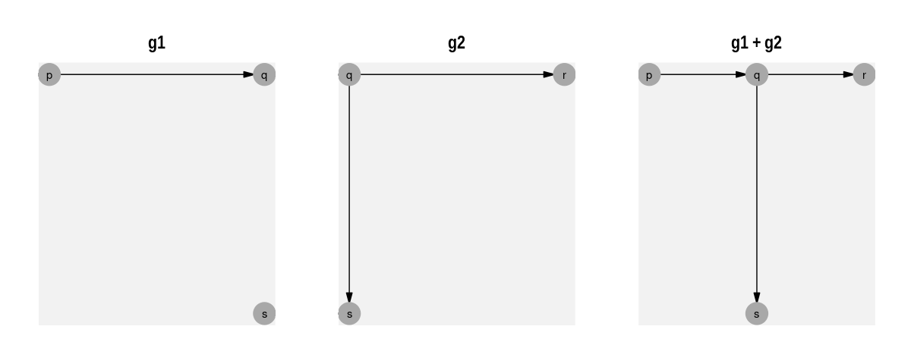
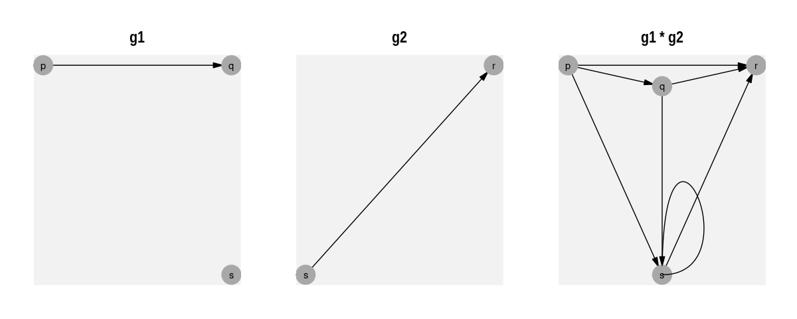
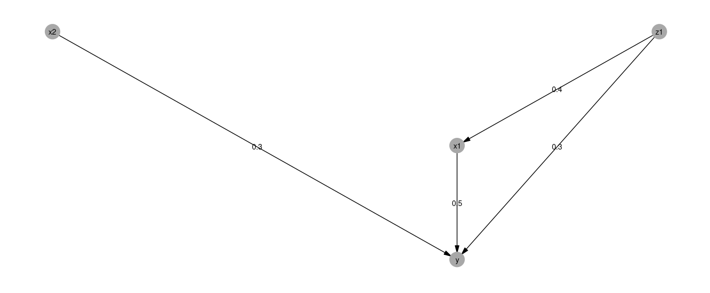

<!-- README.md is generated from README.Rmd. Please edit that file -->

# ralget

Ralget creates and combines graphs with algebraic operations.

### Combining Vertices

Take the following vertices:

``` r
p <- v("p") 
q <- v("q") 
s <- v("s") 
r <- v("r") 
```

The `+` operator places vertices in the same graph.  
The `*` operator joins one vertex to another.

``` r
g1 <- p * q + s
g2 <- q * s + q* r
g3 <- s * r
```


### Combining graphs

#### Overlaying graphs ( + )

The `+` operator overlays graphs.

``` r
g1 + g2
```



#### Connecting graphs ( \* )

The `*` operator creates a link from each vertex in the first graph to
each vertex in the second graph.

``` r
g1 * g3
```



#### The Cartesian product ( %x% )

The `%x%` operator creates the graph product.

``` r
x %x% y
#> Joining, by = "name"
```


### Some more on vertices

Vertices are created with the `v()` function, which takes a name and
list of attributes associated with the vertex. This creates a
ralget/tidygraph object:

``` r
v("x", Latitude=  78.26077, Longitude=  -94.11077)
#> # A tbl_graph: 1 nodes and 0 edges
#> #
#> # A rooted tree
#> #
#> # Node Data: 1 x 2 (active)
#>   name  .attrs          
#>   <chr> <list>          
#> 1 x     <named list [2]>
#> #
#> # Edge Data: 0 x 2
#> # … with 2 variables: from <int>, to <int>
```

### Installation

You can install the development version from
[GitHub](https://github.com/) with:

``` r
# install.packages("devtools")
devtools::install_github("ianmoran11/ralget")
```

## Algegraic laws

### Addition is commutative

*V*<sub>1</sub> + *V*<sub>2</sub> = *V*<sub>2</sub> + *V*<sub>1</sub>

``` r
(v1+v2)==(v2+v1)
#> [1] TRUE
```

*V*<sub>1</sub> × *V*<sub>2</sub> ≠ *V*<sub>2</sub> × *V*<sub>1</sub>

``` r
(v1*v2)==(v2*v1)
#> [1] FALSE
```

### Multiplication is distributive

``` r
(v1*(v2+v3))==((v1*v2)+(v1*v3))
#> [1] TRUE
```

*V*<sub>1</sub> × (*V*<sub>2</sub>+*V*<sub>3</sub>) = *V*<sub>1</sub> × *V*<sub>2</sub> + *V*<sub>1</sub> × *V*<sub>3</sub>

``` r
((v2+v3)*v1)==((v2*v1)+(v3*v1))
#> [1] TRUE
```

### Edges

Edge attributes are added by interleaving e() between graph
multiplication.

Here’s a simple example:

``` r
v("X1") * e("E:X1.X2") * v("X2")
```



This provides a framework for constructing and simulating data from
DAGs.

``` r
z1 <- v("z1", form = quo(rnorm(1,100,15)))
x1 <- v("x1", form = quo(rnorm(1,100,15)))
x2 <- v("x2", form = quo(rnorm(1,100,15)))
 y <- v("y", form = quo(rnorm(1,0,15)))

reg <-   (sumv(x1*e(.5), x2*e(.3))*y) + ((z1*sumv(e(.4)*x1, e(.3)*y))) 

reg <-      ( x1*e(.5) + x2*e(.3)) * y  + 
       z1 * ( e(.4)*x1 +  e(.3)*y)

empty_graph <- v("") %>% filter(row_number() < 1)
ggraph(empty_graph) + plot(reg) + ggraph(empty_graph)
```


``` r
ralget_sim(reg, 1000)
#> # A tibble: 1,000 x 4
#>       x2    z1    x1     y
#>    <dbl> <dbl> <dbl> <dbl>
#>  1 104.   90.4  128. 105. 
#>  2  79.9  87.4  146. 160. 
#>  3  94.2  62.5  111.  93.5
#>  4 115.  103.   138. 120. 
#>  5 110.  100.   140. 105. 
#>  6 104.  130.   157. 136. 
#>  7  76.1  94.6  155. 128. 
#>  8  85.3  86.8  130. 120. 
#>  9 101.  109.   131. 130. 
#> 10 104.  108.   111. 116. 
#> # … with 990 more rows
```
