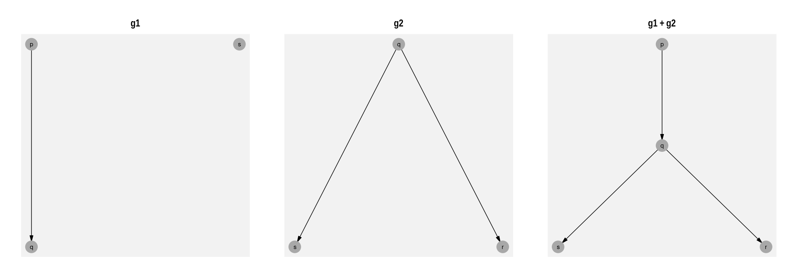

<!-- README.md is generated from README.Rmd. Please edit that file -->

# ralget

Ralget creates algebraic graphs in R.

## Installation

You can install the evelopment version from
[GitHub](https://github.com/) with: You can install the evelopment
version from [GitHub](https://github.com/) with:

``` r
# install.packages("devtools")
# install.packages("devtools")
devtools::install_github("ianmoran11/ralget")
```

## Example

This is a basic example which shows you how to solve a common problem:

# The building blocks of charts

### Vertices

Vertices are created with the `v()` function, which takes a name and
list of attributes associated with the vertex. This creates a
ralget/tidygraph object:

``` r
v("x", Latitude=  78.26077, Longitude=  -94.11077)
#> # A tbl_graph: 1 nodes and 0 edges
#> #
#> # A rooted tree
#> #
#> # Node Data: 1 x 2 (active)
#>   name  .attrs          
#>   <chr> <list>          
#> 1 x     <named list [2]>
#> #
#> # Edge Data: 0 x 2
#> # … with 2 variables: from <int>, to <int>
```

### Combining Vertices

The `+` operator overlays graphs.

The `*` operator creates a link from each vertex on the right to each
vertex on the left.

    #> # A tbl_graph: 3 nodes and 1 edges
    #> #
    #> # A rooted forest with 2 trees
    #> #
    #> # Node Data: 3 x 2 (active)
    #>   name  .attrs
    #>   <chr> <list>
    #> 1 p     <NULL>
    #> 2 q     <NULL>
    #> 3 s     <NULL>
    #> #
    #> # Edge Data: 1 x 3
    #>    from    to new  
    #>   <int> <int> <lgl>
    #> 1     1     2 TRUE


``` r
g2 <- q*s+q*r
g1 <- p*q+s
gg <- (g1+g2)
```




