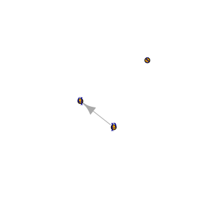

<!-- README.md is generated from README.Rmd. Please edit that file -->

# ralget

Ralget creates and combines graphs with algebraic operations.

### Combining Vertices

Take the following vertices:

``` r
p <- v("p") 
q <- v("q") 
s <- v("s") 
r <- v("r") 
```

The `+` operator places vertices in the same graph.  
The `*` operator joins one vertex to another.

``` r
g1 <- p * q + s
g2 <- q * s + q* r
g3 <- s * r
```



### Combining graphs

#### Overlaying graphs ( + )

The `+` operator overlays graphs.

``` r
g1 + g2
```


#### Connecting graphs ( \* )

The `*` operator creates a link from each vertex in the first graph to
each vertex in the second graph.

``` r
g1 * g3
```


#### The Cartesian product ( %x% )

The `%x%` operator creates the graph product.

``` r
x %x% y
```


### Some more on vertices

Vertices are created with the `v()` function, which takes a name and
list of attributes associated with the vertex. This creates a
ralget/tidygraph object:

``` r
v("x", Latitude=  78.26077, Longitude=  -94.11077)
#> # A tbl_graph: 1 nodes and 0 edges
#> #
#> # A rooted tree
#> #
#> # Node Data: 1 x 2 (active)
#>   name  .attrs          
#>   <chr> <list>          
#> 1 x     <named list [2]>
#> #
#> # Edge Data: 0 x 2
#> # … with 2 variables: from <int>, to <int>
```

### Installation

You can install the development version from
[GitHub](https://github.com/) with:

``` r
# install.packages("devtools")
devtools::install_github("ianmoran11/ralget")
```
